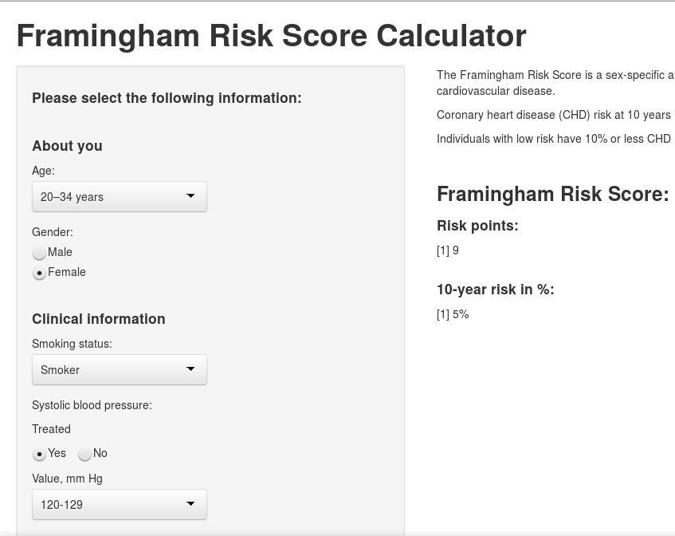

Framingham Risk Score Calculator
========================================================
author: Andrey Kuznetsov
date: 25 Jan 2015

Framingham Risk Score 
========================================================

<small>
Welcome to **the Framingham Risk Score Calculator**. You can use this calculator to work out your risk of having a heart disease or stroke over the next ten years by answering some simple question.

- **The Framingham Risk Score** is a sex-specific algorithm used to estimate the 10-year cardiovascular risk of an individual, i.e. chances of developing cardiovascular disease.
- **The Framingham Risk Score** algorithm was first developed based on data obtained from the Framingham Heart Study, to estimate the 10-year risk of developing coronary heart disease.
- Coronary heart disease (CHD) risk at 10 years in percent can be calculated with the help of the Framingham Risk Score.
</small>

The Application
========================================================

The Framingham Risk Score allows to calculate both rik points and risk score in % of developing a heart disease in individual over 10 years.

The application was developed using **shiny** and deployed at https://ankuznetsov.shinyapps.io/Framingham_risk_score/

Information Gathering
========================================================

<small>
To calculate risk points the application uses data about user's age, gender, smoking status, sistolic blood pressure, total and HDL cholesterol.

A user can select appropriate values using standard controls in the left panel of the application:


</small>

Risk Calculation
========================================================

<small>
- To calculate risk points for men and women the application uses two different functions with the same parameters, **points.men** and **points.women**:


```r
points.men <- function(age, totchol, smoker, HDLChol, treated, SBP)
```

- Values were obtained from the input components:


```r
age <- reactive({as.numeric(input$AgeSelect)})
```
</small>

Risk Calculation
========================================================

<small>
- The following operation is performed when user presses the **Calculate risk** button:


```r
output$PointsOutput <- renderPrint({
            if(input$RiskButton > 0)
            {
                if(sex() == 'Male')
                {
                    points.men(age(), totchol(), smoker(), HDLChol(), treated(), SBP())
                }
                else if(sex() == 'Female')
                {
                    points.women(age(), totchol(), smoker(), HDLChol(), treated(), SBP())
                }
            }
        })
```

</small>

